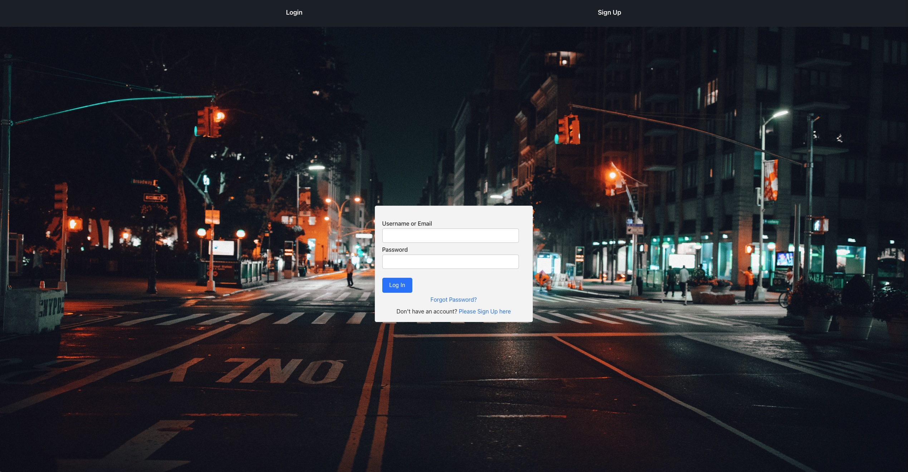
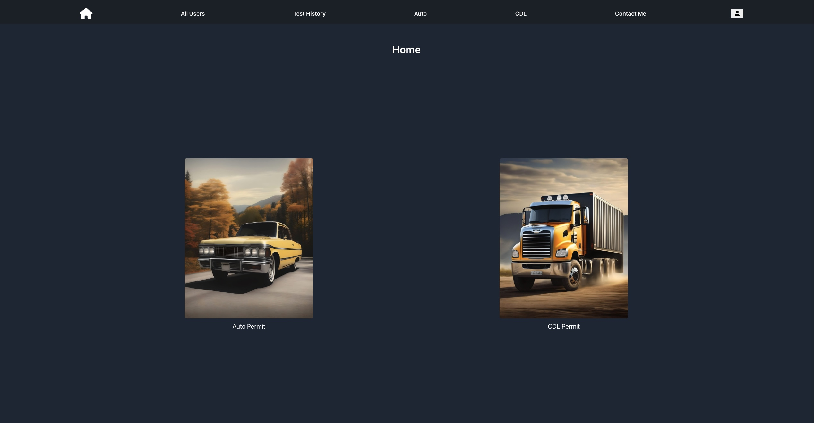
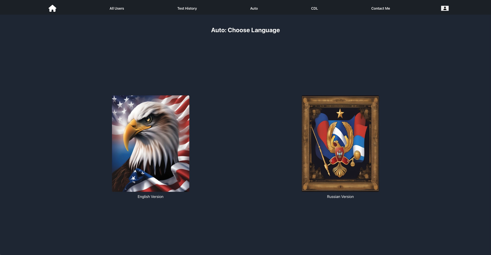
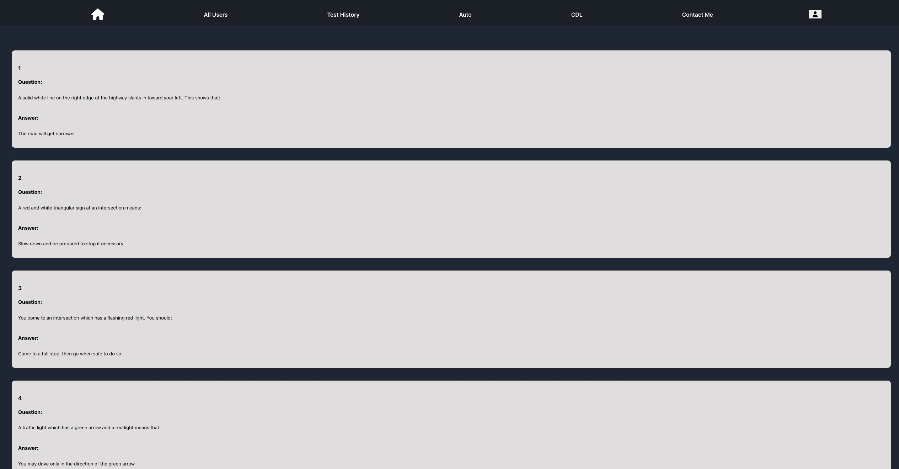
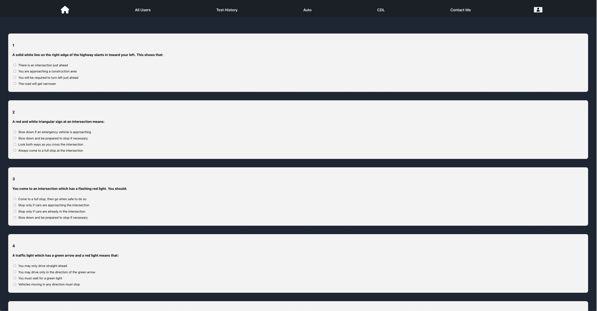
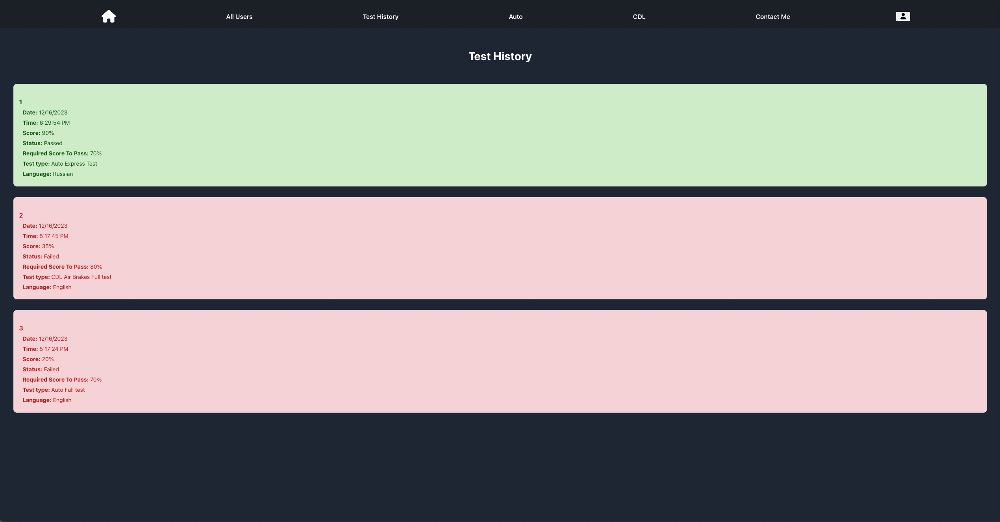
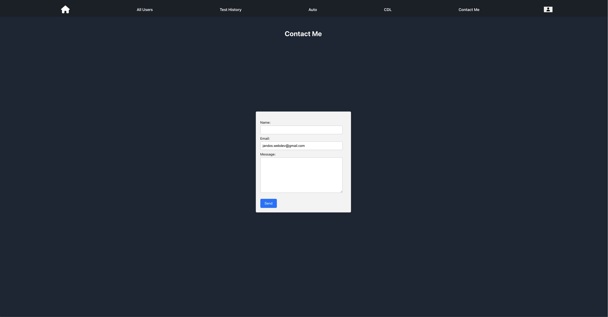

# NYC Permit Hub Website

Welcome to the NYC Practice Permit Test project! This web application is designed to help individuals prepare for their New York City driver's permit test by providing a platform to practice answering questions similar to those on the actual exam.

You can access the live project here: [NYC Permit Hub](https://nyc-permit-hub.onrender.com)

## Table of Contents
- [Screenshots](#screenshots)
- [Features](#features)
- [Technologies Used](#technologies-used)
- [Getting Started](#getting-started)
  - [Installation](#installation)
  - [Usage](#usage)
- [License](#license)

<h2 id="screenshots">Screenshots</h2>

Here are some screnshots of the NYC DMV Driver Permit Website:

### Login Page

### Home Page

### Auto Page

### Learn Page

### Test Page

### Test Result Page

### Contact Me Page

<h2 id="features">Features</h2>

- **Realistic Questions:** Access a collection of practice questions that closely resemble the questions found in the official NYC permit test.
- **Multiple Choice:** Questions are presented in a multiple-choice format, just like the actual test.
- **Randomized Quizzes:** Take randomized quizzes to simulate the variability of the real exam.
- **Immediate Feedback:** Receive instant feedback on your answers and learn from explanations for both correct and incorrect choices.
- **Responsive Design:** The web application is designed to work seamlessly across various devices, including desktops, tablets, and smartphones.

<h2 id="technologies-used">Technologies Used</h2>

- HTML5
- CSS
- JavaScript
- React.js
- Redux
- React Router
- Express
- Postgres
- Sequelize
- JWT (JSON Web Token)

<h2 id="getting-started">Getting Started</h2>

<h3 id="installation">Installation</h3>

To run the project locally, follow these steps:

1. Clone this repository: `git clone https://github.com/jandos0492/nyc-permit-hub.git`
2. Navigate to the project directory: `cd nyc-permit-hub`
3. Navigate to the backend directory: `cd backend`
4. Install backend dependencies: `npm install`
5. Create the database: `npm run db:create`
6. Start the backend development server: `npm start`
    - The backend server should now be accessible in your browser at `http://localhost:3000`
7. Navigate to the frontend directory: `cd ../frontend`
8. Install the frontend dependencies: `npm install`
9. Start the development server: `npm start`
    - The website should now be accessible in your browser at: `http://localhost:3001`

<h3 id="usage">Usage</h3>

The NYC Practice Permit Test platform offers a structured approach to help you prepare for your New York City driver's permit test. Follow these steps to make the most of the practice materials:

#### 1. User Authentication

- **Sign Up:** If you're a new user, click on the "Sign Up" link located on the navigation bar. Provide the required information to create your account. 

- **Sign In:** If you already have an account, click on the "Sign In" link on the navigation bar. Enter your credentials (email and password) to log in. If you forget your password, use the "Forgot Password" link to reset it.

#### 2. Choose Your Permit Type

- **Auto Permit:** If you are preparing for a regular driver's permit, select the "Auto Permit" option to access relevant practice materials tailored for non-commercial vehicles.

- **CDL Permit:** For individuals aiming to obtain a Commercial Driver's License (CDL), choose the "CDL Permit" option. This section includes specific questions and information relevant to commercial driving.

#### 3. Learn Traffic Signs

Before you start practicing questions, it's crucial to familiarize yourself with common traffic signs, symbols, and their meanings. Understanding these signs is essential for safe and responsible driving. The "Learn Traffic Signs" section provides a comprehensive guide to various traffic signs you may encounter on the road.

#### 4. Learn All the Questions

Begin your preparation by exploring the full collection of practice questions available in the "Learn All the Questions" section. Each question is designed to cover important topics related to road rules, traffic regulations, and safe driving practices. Take your time to read and understand the questions and their corresponding options.

#### 5. Pass the Test for All the Questions

Once you feel confident with the material, challenge yourself by taking the "Pass the Test for All the Questions" quiz. This quiz includes all the practice questions from the question bank. Answer each question to the best of your knowledge and receive instant feedback on your choices. Review the explanations for both correct and incorrect answers to enhance your understanding.

#### 6. Pass the Test for Random 20 Questions

To simulate the experience of the actual permit test, take the "Pass the Test for Random 20 Questions" quiz. This quiz randomly selects 20 questions from the question bank, providing a dynamic and varied testing environment. This approach helps you gauge your readiness and adaptability to different question scenarios.

#### 7. Switch to Russian Language (Для изучения на русском языке)

For users who prefer to learn in Russian, you can switch the platform's language to Russian. This option is available to make the learning process more comfortable for non-English speakers. Simply access the language settings and choose Russian to access all materials in Russian.

#### 8. View Test Results

After completing each quiz or test, you can view your test results on the "Test Results" page. Each result includes the following information:

- **Date:** The date when the test was taken (e.g., 12/16/2023).

- **Time:** The time when the test was completed (e.g., 6:29:54 PM).

- **Score:** Your overall score on the test, represented as a percentage (e.g., 90%).

- **Status:** Indicates whether you passed or failed the test.

- **Required Score To Pass:** The minimum score needed to pass the test (e.g., 70%).

- **Test Type:** Specifies the type of test taken, such as "Auto Express Test" or "CDL Full Test."

- **Language:** The language in which the test was conducted, either English or Russian.

Reviewing your test results provides valuable insights into your performance, allowing you to track your progress and focus on areas that may require further study. Use this information to enhance your preparation and increase your chances of success on the actual permit test.

#### 9. Contact Me

If you have any questions, concerns, or feedback, we encourage you to use the "Contact Me" page. Follow these steps to submit your inquiries:

- Navigate to the "Contact Me" page on the website.

- Fill out the provided form with the required information.

  - **Name:** Enter your full name.
  
  - **Email:** Provide a valid email address for communication.
  
  - **Message:** Write your detailed message or question.

- Click the "Submit" button to send your message.

Our team is dedicated to providing assistance and addressing any queries you may have. We appreciate your engagement and look forward to helping you on your journey to obtaining your driver's permit.

Feel free to reach out, and we'll get back to you as soon as possible!

Remember, consistent practice and understanding of the material are key to performing well on your permit test. Feel free to revisit different sections as needed to reinforce your knowledge and build confidence for the real exam.

Happy learning and safe driving!

<h2 id="license">License</h2>

This project is licensed under the MIT License.